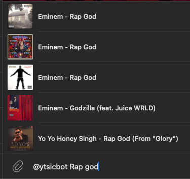
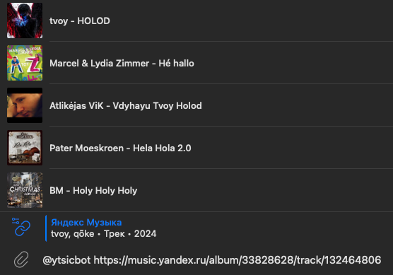

# Yandex to Spotify inline converter (ytsic) telegram bot

This is an inline telegram bot with search and url convert capabilities

 

## Bot description

This is Spotify inline search bot!

You can search for any track in spotify just by typing 
@ytsicbot <track name>.
If you want to search for a track in yandex music, just add $ before the track name.
This bot can also handle URL conversions. Just add url after the @ytsicbot and the bot will convert yandex url to spotify url and vice versa!

## Installation
Before installation, you need to acquire Yandex Music token and Spotify 
client and secret tokens. You can find information about how to get them here: 
[Yandex API docs](https://yandex-music.readthedocs.io/en/main/token.html),
[Spotify API docs](https://developer.spotify.com/documentation/web-api/tutorials/getting-started)

To set up the bot running, you must also get bot token from [@botfather](t.me/botfather).
After your bot is ready, turn on inline mod by sending `/setinline` command to @botfather and 
setting prompt.

After you've got the tokens and the bot running, you'll need to fill this information into the `settings.py`:
```python
class SETTINGS:
    # Various tokens
    YANDEX_TOKEN: str = "<Your yandex api token>"
    SPOTIFY_CLIENT: str = "<Your spotify client token>"
    SPOTIFY_SECRET: str =  "<Your spotify secret token>"
    TELEGRAM_TOKEN: str = "<Your telegram bot token>"
    
    # Additional info
    BOT_TAG: str = "@yourbottag" # change it for the name chosen by you in bot father
    SPOTIFY_MARKET_LOCALE: str = "XX" # Spotify market (Do not choose RU, spotify is unavailable in Russia)
```

Then you need to install pip requirements and activate python environment:

```shell
python -m venv .env
source .env/bin/activate #for UNIX (run activate.ps2 for windows)
pip install -r requirements.txt
```

# Usage
```shell
python inline-bot.py
```

